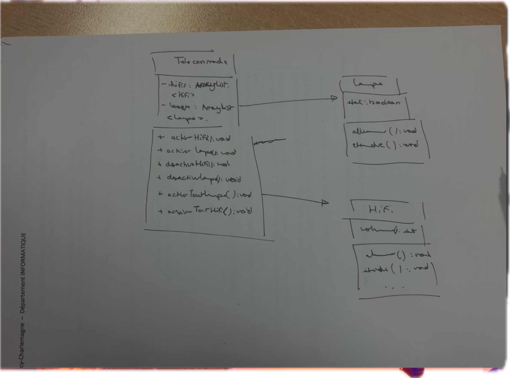
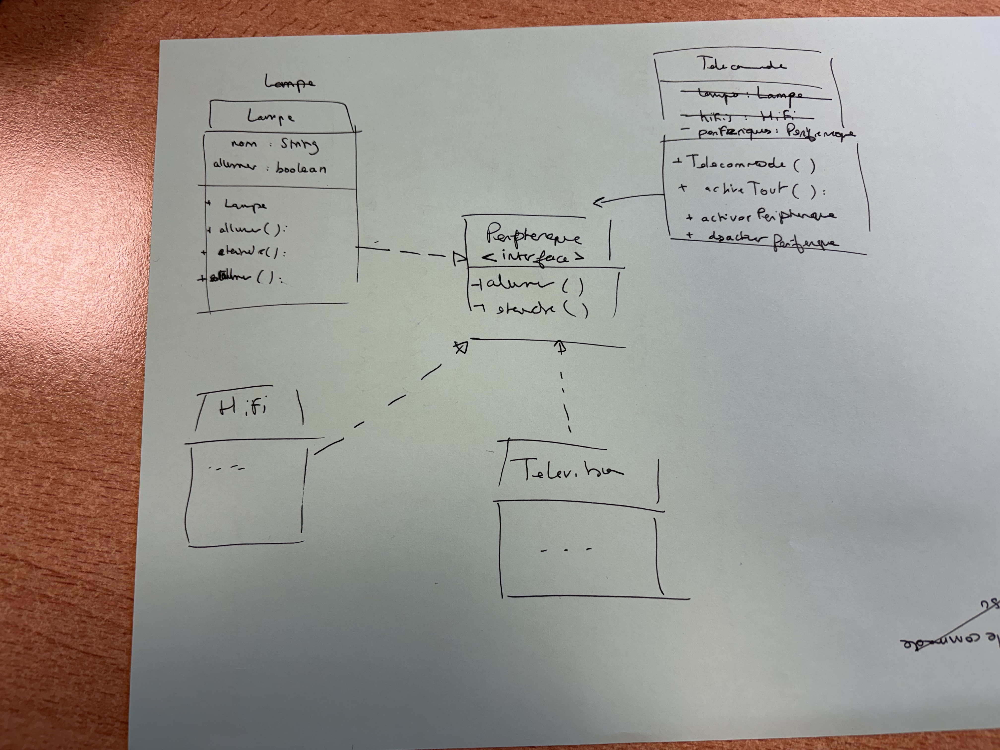

## Q3

  
Quelles ont été les modifications que vous avez du faire à la version v1.0 pour pouvoir gérer des chaines Hifi ?

    
    git log --oneline
    git diff e6685d6 aab8cf6

33 lignes ont étaient modifiées dans lequels on a ajouter les methodes de la classe Hifi a la classe telecommande

## Q5

  
Avez vous fait un copier-coller de code dans la classe Telecommande ?
Que se passe-t-il si ce code possédait un bug ou si on souhaite modifier les indices
selon lesquels sont stockés les éléments (chaine hifi) ? Pensez-vous que le code est
facilement maintenable ?

Non pas de copier-coller.
Le bug se repercute sur la classe Hifi aussi.
Ce code n'es pas facilement maintenanable parce qu'il est repetitif 
    

## Q6

  
Dans votre diagramme de classe, quelle est la direction des flèches représentant
les associations ? Qu’est-ce que cela implique en terme de modification de code ?
En particulier, que se passerait-il si la chaine hifi ne possède plus les méthodes
eteindre et allumer mais augmenterSon ou baisserSon

Les fleches partent de Telecommande et s'arretent à Hifi (<|--)
Cela implique que lorsqu'on modife la classe Hifi on doit veuillez a ne pas avoir generer d'erreur dans la classe Telecomande en modifiant la classe Hifi. 

## Q12

  
Réfléchir aux questions posées précédemment (Q1 à Q5) et expliquer la manière
dont votre nouvelle conception y répond.

La nouvelle conception y repond en introduisant une interface qui permet de gerer (Allumer/Eteindre/Allumer tout) pour nimporte quel objet implementant peripherique  

