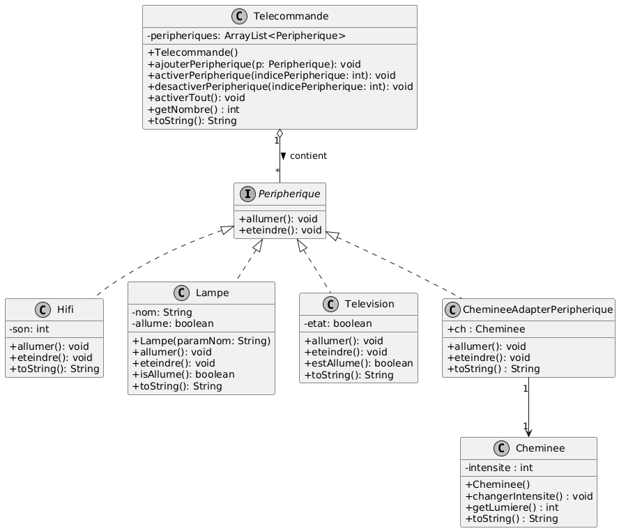

## Q1 
>Expliquer votre solution pour manipuler la classe Cheminee comme un Appareil.
>>Pour repondre à la problematique je choisi de creer une classe intermediaire permettant d'implementer peripherique tout en utilisant les methodes definis dans la classe Cheminee

## Q2 
>Une fois que vos idées sont claires, écrivez un diagramme de classe qui présente
votre conception avec l’ensemble des classes disponibles depuis le début des TP
>> 